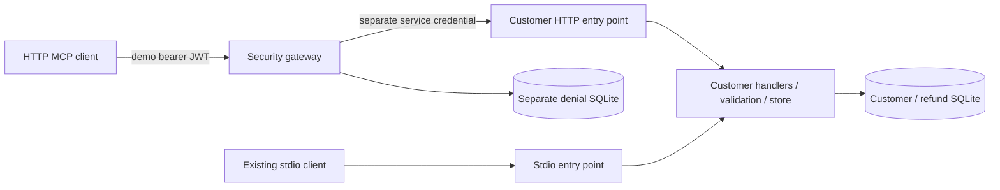

# BridgeLayer

BridgeLayer is an independent software and AI development project exploring customer-support integrations through MCP. It provides fictional customer lookup and simulated refunds through a TypeScript MCP service, with SQLite persistence and an authenticated HTTP security gateway.

Developed by **Yu-Chen Su (Will), Independent Software & AI Consultant**. The personal/FDE prototype was previously named SupportBridge and predates the active professional development phase beginning **September 11, 2026**. This is a customer-inspired integration case study, with no evidenced actual client engagement.

## Problem being solved

Customer-support integrations need a clear boundary between incoming requests, authenticated callers, permitted operations, business rules, and stored results. BridgeLayer demonstrates those boundaries with discoverable MCP tools and reproducible success/failure cases. The current interface is a developer-operated client; no operator UI or LLM agent is implemented.

## Current capabilities

### Available Now

| Capability | Implemented behavior |
| --- | --- |
| Task 1: customer MCP service | Original stdio server with strict validation, lookup, simulated refunds, SQLite, and rollback tests. |
| Task 2: HTTP MCP security gateway | Stateless HTTP MCP with signed demo JWTs, role policy, request correlation, and separate downstream credentials. |
| `get_customer_record` | Takes `customer_id`; returns a fictional record or business error. |
| `trigger_refund` | Takes `customer_id`, `amount`, `reason`; atomically stores a simulated refund and its success audit. |
| `admin_health_check` | HTTP-only harmless admin test tool; returns fixed health information without data changes. |
| Denial audit / diagnostics | Separate SQLite denial records; correlated gateway outcomes and durations; no bearer tokens or tool arguments in diagnostic fields. |
| Verification / demos | Real stdio and HTTP tests, official SDK clients, fault injection, and separate stdio/HTTP demos. |

Customer IDs require five ASCII digits after `CUST-`; extra arguments are rejected. Amounts must be finite positive numbers, with no string coercion; the store additionally requires safely representable whole cents. Reasons are trimmed before the ten-character minimum check. Receipts return integer `amount_cents`, USD currency, and simulated status.

### Planned

**Tasks 3–4 remain planned:** streaming PII guardrails and token limiting/model fallback. The React support console is also planned. Live agents, real customer APIs, and hosted deployment remain separate extension candidates.

## Architecture



Both HTTP listeners bind loopback. The local launcher runs them in one Node process; these are separate HTTP trust boundaries, not OS-process isolation. Each POST has its own SDK transport; there is no shared MCP session state. The original stdio entry point remains available with two tools.

The gateway authenticates every request, leaves authenticated discovery unfiltered, and denies non-admin `admin_` calls before forwarding. Downstream headers are explicitly constructed; the client's bearer token is never passed through.

**No LLM chooses tools:** both demo clients call them explicitly. See [architecture](docs/ARCHITECTURE.md) for boundaries and limitations.

## Example workflow

```sh
npm run demo:http
```

The temporary HTTP demo initializes viewer/admin clients and demonstrates:

1. A viewer discovers all three HTTP tools, including the admin tool.
2. Customer lookup returns fictional Alex Rivera.
3. A simulated refund returns `amount_cents: 1250`.
4. Viewer admin execution fails with `-32001: Unauthorized Tool Call`.
5. Admin execution succeeds.
6. Missing credentials fail with HTTP 401.

It generates temporary credentials/databases, does not print tokens, and cleans up afterward. `npm run demo` still runs the original stdio demonstration.

## Tech stack

Repository pins: TypeScript `7.0.2`, MCP SDK `1.30.0`, Zod `4.5.4`, and `jose` `6.2.12` for JWTs. The application uses Node.js ES modules, built-in HTTP/SQLite, npm, and Node's test runner. No application HTTP framework, React app, or LLM SDK is introduced.

## Setup

Use Node 24 (`.nvmrc`); the package minimum is Node 22.13.0.

```sh
npm ci
npm run check
npm run demo:http
```

The demo requires no external API key. For persistent HTTP operation, build, set two different secrets of at least 32 bytes, and run:

```sh
npm run build
export BRIDGELAYER_JWT_SECRET="$(node -e 'process.stdout.write(require("node:crypto").randomBytes(32).toString("hex"))')"
export BRIDGELAYER_SERVICE_KEY="$(node -e 'process.stdout.write(require("node:crypto").randomBytes(32).toString("hex"))')"
npm run start:http
```

Gateway: `http://127.0.0.1:3030/mcp`. Protected customer service: port `3031`. Stop with Ctrl+C. The [Task 2 walkthrough](docs/02-http-gateway-walkthrough.md) covers token issuance, configuration, protocol headers, failures, and audit lifecycle. Tokens issued by the local operator last at most 15 minutes; this is not a full OAuth authorization server.

For persistent stdio operation, use `node dist/src/mcp/stdio.js`. It waits for MCP input, not interactive terminal commands. A host should spawn Node directly; normal npm banners can contaminate protocol stdout.

Naming compatibility: package `supportbridge`, MCP server `supportbridge-customer`, `SUPPORTBRIDGE_DB`, default `data/supportbridge.sqlite`, and `supportbridge.code-workspace` retain their working names. Gateway denials default to `data/gateway-audit.sqlite`. Both database paths are configurable.

## Testing

On **September 15, 2026**, local type checking and **23 tests/subtests** passed on Node `25.5.0`, including the existing six stdio tests and new HTTP integration/failure checks. The HTTP SDK-client demo also completed. The suite now verifies original refund/audit records after a complete server restart.

HTTP coverage includes token validation, direct-service rejection, zero downstream calls after denial, durable denial records, audit failure, Origin/Host checks, invalid/batched/oversize input, credential separation, concurrent identical request IDs, downstream reply validation, timeout, disconnect/shutdown cancellation, and log privacy.

These runs used installed dependencies. A fresh `npm ci`, recommended Node 24 run, and remote Node 22/24 CI matrix are not yet verified. Node may emit a SQLite warning on stderr without breaking protocol behavior.

Final recheck on September 16 (America/Chicago): type checking and all 23 tests/subtests passed again after request-cleanup changes; the original stdio demo also completed.

| Failure | Existing response |
| --- | --- |
| Missing/invalid gateway credentials | HTTP 401 with Bearer challenge |
| Non-admin `admin_` call | HTTP 200; JSON-RPC `-32001: Unauthorized Tool Call`, same ID |
| Invalid tool arguments / unknown tool | JSON-RPC `-32602` |
| Customer missing / unsupported money precision | Tool result `isError: true` |
| Unexpected customer-service exception | Sanitized JSON-RPC `-32603` |
| Invalid/unavailable downstream or audit failure | Sanitized HTTP 502 / `-32002` |
| Downstream timeout | HTTP 504 / `-32003`; operation outcome may be unknown |

See the [decision log](docs/decisions.md) for pinned SDK framing/error details and the [HTTP walkthrough](docs/02-http-gateway-walkthrough.md) for boundary-level HTTP errors.

## Current development status

Task 1 predates September 11. Scope/documentation reconciliation belongs to the new phase; Task 2 and the restart regression were implemented and validated in this phase, with current verification dated September 15. Git history has not been rewritten.

Limits: fictional records are shared, without tenant data isolation. Viewers can create simulated refunds; the admin-prefix rule is not real-payment authorization. Requests are never automatically retried; aborting a timeout cannot undo a committed refund. Denial auditing has no automated retention policy. There is no hosted deployment, measured production capacity, streaming guardrail, token budget, or AI workflow.

## Roadmap and learning

1. Task 1 — implemented; retain stdio compatibility.
2. Task 2 — implemented locally; HTTP/security behavior and demonstrations are tested.
3. Task 3 — planned streaming PII guardrails.
4. Task 4 — planned token budgets/model fallback.

Read the [project plan](docs/PROJECT_PLAN.md), [active scope](docs/PROJECT_SCOPE.md), and [development backlog](docs/DEVELOPMENT_PLAN.md). Start code discussion with the [stdio walkthrough](docs/01-mcp-walkthrough.md) and [HTTP walkthrough](docs/02-http-gateway-walkthrough.md). VS Code tasks/debugging and the [handoff](HANDOFF.md) support continuing the explain → agree → implement → demonstrate → practice workflow.
