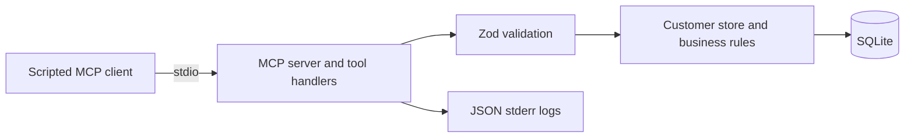

# BridgeLayer

BridgeLayer is an independent software and AI development project exploring customer-support integrations through MCP. The working system exposes fictional customer lookup and simulated refunds through a TypeScript MCP server, with strict validation, SQLite persistence, and tests over actual stdio.

Developed by **Yu-Chen Su (Will), Independent Software & AI Consultant**. BridgeLayer builds on the personal/FDE prototype previously named SupportBridge. The current active professional development phase began **September 11, 2026**; the project and its implemented foundation predate that phase. This is a customer-inspired integration case study, with no evidenced actual client engagement.

## Problem being solved

Support operations need a clear boundary between incoming requests, validated arguments, business rules, and stored results. This reference scenario demonstrates that boundary through discoverable MCP tools and reproducible failures. Its intended support workflow is customer lookup followed by a simulated refund; the current interface is a developer-operated client.

## Current capabilities

### Available Now

| Capability | Behavior |
| --- | --- |
| MCP discovery | One stdio server advertises two tools with JSON input schemas. |
| `get_customer_record` | Takes `customer_id`; returns a fictional customer or a business error. |
| `trigger_refund` | Takes `customer_id`, `amount`, and `reason`; stores a simulated USD refund and its success audit event atomically. |
| Validation and persistence | Strict Zod arguments, whole-cent business checks, and on-disk SQLite. |
| Verification | Six tests, an official SDK-client demo, and VS Code debugging configuration. |
| Diagnostics | Structured stderr logs for handled tool outcomes; coverage gaps are documented below. |

IDs require five ASCII digits after `CUST-`. Extra arguments are rejected. Amounts must be finite positive JSON numbers; numeric strings are not converted. Reasons are trimmed before a ten-character minimum check. The store additionally rejects fractional cents and amounts beyond its safe integer-cent range. Receipts report `amount_cents`, `currency`, and `status: "simulated"`.

### Planned

HTTP MCP access and a security gateway are next. Streaming PII protection, token budgets, model fallback, and a React support console are later roadmap work. None is implemented. Live agent execution and external API vendors remain separate extension candidates.

## Architecture

All components in this diagram exist:



The SDK handles protocol initialization, dispatch, serialization, and request correlation. The store owns customer lookup and refund/audit transactions. Server stdout carries protocol messages; stderr carries diagnostics.

The current demo explicitly selects tools in code. **There are no LLM calls or autonomous agent decisions.** The MCP interface is working infrastructure for possible future AI workflows.

See [architecture and trust boundaries](docs/ARCHITECTURE.md) for current limitations and clearly labeled planned components.

## Example workflow

`npm run demo` launches a real server process, initializes MCP, discovers tools, retrieves `CUST-00001`, creates a simulated refund for `12.5` USD, and demonstrates rejection of a negative amount.

Expected values include:

- Discovered tools: `get_customer_record`, `trigger_refund`.
- Customer: the fictional Alex Rivera.
- Receipt: `amount_cents: 1250`, `currency: "USD"`, `status: "simulated"`.
- Invalid amount: JSON-RPC `-32602`.

The demo uses a temporary database and removes it afterward. Its human-readable output comes from the client process.

## Tech stack

Repository pins: TypeScript `7.0.2`, official MCP SDK `1.30.0`, and Zod `4.5.4`. The application uses Node.js, ES modules, built-in `node:sqlite`, npm, and Node's test runner. A GitHub Actions workflow is configured for Node 22 and 24.

React, an HTTP framework, and an LLM SDK are not used by the current application source.

## Setup

Use Node 24, as specified in `.nvmrc`. The package declares Node `>=22.13.0`. No API key is required for the current demo.

```sh
npm ci
npm run check
npm run demo
```

For a persistent server:

```sh
npm run build
node dist/src/mcp/stdio.js
```

The default database is `data/supportbridge.sqlite`, relative to the working directory. To choose another path:

```sh
SUPPORTBRIDGE_DB="$PWD/data/demo.sqlite" node dist/src/mcp/stdio.js
```

The server waits for newline-delimited MCP messages on stdin; it is not an interactive prompt. An MCP host should spawn `node` directly with the absolute path to `dist/src/mcp/stdio.js`. Normal npm script banners share stdout and can disrupt the protocol; `npm run --silent start:mcp` is available for manual use.

**Naming compatibility:** BridgeLayer is the project documentation name. Existing executable/configuration identifiers remain `supportbridge` (package), `supportbridge-customer` (MCP server), `SUPPORTBRIDGE_DB`, and `supportbridge.code-workspace`. The default database filename also retains the earlier name.

Open the folder or workspace file in VS Code. Build, Test, and Demo tasks and a debugger with child-process attachment are configured. Start with the [walkthrough](docs/01-mcp-walkthrough.md) or [handoff](HANDOFF.md).

## Testing

Local validation on **September 11, 2026**, using installed dependencies and Node `25.5.0` / npm `11.8.0`, passed type checking, all six tests, and the SDK-client demo. This was recorded before the documentation reconciliation; no application changes were made by that reconciliation. A fresh install and the remote Node 22/24 CI matrix were not verified.

Five tests launch the real stdio server. Coverage includes discovery, invalid arguments without writes, whole cents, business errors, injected audit failure with rollback, sanitized errors, malformed frames, request correlation, notifications, and stdout isolation. One test directly checks non-JSON numeric inputs. A full server-restart refund/audit regression remains planned.

| Failure | Existing response |
| --- | --- |
| Invalid tool arguments / unknown tool | JSON-RPC `-32602` |
| Unknown JSON-RPC method | JSON-RPC `-32601` |
| Malformed JSON / invalid message envelope | `-32700` / `-32600`; no correlatable ID in the pinned SDK envelope |
| Customer missing / unsupported monetary precision | Tool result with `isError: true` and a business error code |
| Unexpected customer-service exception | Sanitized JSON-RPC `-32603` |

The explicit error mapping is the existing compatibility contract; its origin and SDK-specific details are in the [decision log](docs/decisions.md). Node may emit a SQLite experimental warning on stderr without contaminating stdout.

## Current development status

The pre-September 11 foundation is implemented. The new phase has established scope/planning documentation and renewed baseline validation. Gateway, authentication, and AI functionality remain planned; documentation approval does not mean implementation has started.

Current limits: local process access grants tool access; there is no tenant data isolation or payment integration. Repeated valid refund calls create separate receipts. Diagnostic logs omit customer records and refund reasons, but malformed call envelopes bypass correlated tool-outcome logging. SQLite audit records cover successful simulated refunds only. No deployment, production throughput, or AI-quality result is claimed.

## Roadmap

1. Maintain the MCP server/tools and strengthen regression evidence.
2. Agree and build the HTTP MCP security gateway.
3. Implement and evaluate streaming PII guardrails in a later phase.
4. Implement and evaluate token reservations and model fallback in a later phase.

Read the [long-term project plan](docs/PROJECT_PLAN.md), [September 11 phase scope](docs/PROJECT_SCOPE.md), and [prioritized development backlog](docs/DEVELOPMENT_PLAN.md). The React console follows working backend demonstrations; live agents and hosting need separate design decisions.
