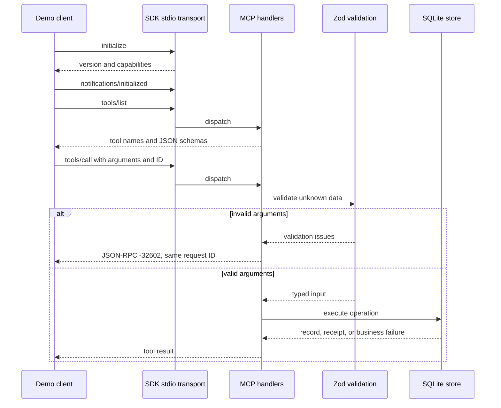

# BridgeLayer — Lesson 1: Follow One MCP Request

This guide explains the working stdio foundation that predates the September 11, 2026 active development phase. The prototype was previously named SupportBridge; executable identifiers retain that name. See the [phase scope](PROJECT_SCOPE.md), [current architecture](ARCHITECTURE.md), and [development backlog](DEVELOPMENT_PLAN.md) for subsequent work.

The goal is to explain the first milestone from request to database result, and to connect unfamiliar TypeScript syntax to ideas you already know from Python.

## Start with the working flow

Run `npm run demo`. The demo is an MCP **client**: a program that asks another program to do something. It spawns the **server**, then uses the official SDK to initialize the connection and call tools. No language model is needed to test this protocol.

The transport owns moving messages. The handler chooses the tool. The schema decides whether input is structurally valid. The store owns customer lookup and refund persistence. These responsibilities are separate so we can later reuse the business logic behind HTTP.

## Read these files in order

1. `src/customer/schemas.ts`: the shortest entry point; inspect what data is allowed.
2. `src/customer/store.ts`: follow a customer lookup and a simulated refund.
3. `src/mcp/server.ts`: see how protocol requests reach those operations.
4. `src/mcp/stdio.ts`: see startup, transport errors, logging, and shutdown.
5. `scripts/demo.ts`: look at the caller's side of the connection.
6. `tests/mcp.test.ts`: see the evidence behind the behavior claims.

## TypeScript through a Python lens

| TypeScript concept | Python comparison | Why it matters here |
| --- | --- | --- |
| `import` / `export` | Importing names from modules | Files expose a small, explicit public surface |
| `type` / `interface` | Type aliases / typed shapes | Describe values to the compiler; do not validate a network request |
| `unknown` | An untrusted value whose type you must inspect | Forces validation before using external input |
| `z.infer<typeof schema>` | Deriving types from a validation model | Keeps compile-time types aligned with runtime schemas |
| `Promise<T>` | An eventual async result | Network operations complete later |
| `async` / `await` | Python async functions and awaiting coroutines | Expresses the order of asynchronous work |
| `const` | A binding you do not reassign | Does not make the bound object deeply immutable |
| `?.` and `??` | Check for missing value / choose a default | Handles absent optional fields without assuming they exist |
| `import type` | A type-checker-only dependency | Disappears from generated JavaScript |

One important difference: calling a JavaScript async function starts it and returns a Promise. Calling a Python async function normally returns a coroutine that must be awaited or scheduled. In both languages, blocking work inside an async workflow can still block other work.

`npm` manages packages and scripts. `tsc` checks and compiles TypeScript into the `dist` folder. Node executes the resulting JavaScript. The SDK implements MCP; Zod validates tool input. Each dependency has a different job.

## Why validation happens at runtime

A function signature can say `amount: number`, but a remote caller can still send `"12.50"`, `true`, or `null`. TypeScript never checked that caller's JSON. Zod performs that check inside the running server.

`safeParse` returns either validated data or issues. We map issues to the required `-32602` response before calling the store. Rejecting extra fields also prevents callers from assuming an unsupported argument, such as `approved: true`, has an effect.

Reason text is trimmed before its minimum-length check. A string of spaces is not a meaningful reason. The advertised JSON Schema represents the basic constraints; the tool description explains trimming, which plain JSON Schema does not perform.

## Why stdout is special

With stdio, one process writes requests into another process's stdin and reads responses from its stdout. The client expects every stdout line to be a protocol message. A startup banner such as `Server started!` is not a JSON-RPC message and can break the connection.

The server therefore logs only through `process.stderr.write`. The demo's `console.log` is intentional: it is a separate human-facing client process. Do not copy it into the server. The tests parse every server stdout line and reject unexpected messages.

## Why errors have layers

A malformed request is different from a legitimate request for a nonexistent customer. Invalid arguments produce a JSON-RPC error under this project's existing compatibility contract. A missing customer produces an MCP tool result marked `isError: true`. An unexpected database error becomes a sanitized internal error.

The request ID connects a response to its request; it is not an authentication token or an idempotency key. A notification has no ID and receives no response. Our tool execution handlers are request handlers, so a `tools/call` notification does not trigger a refund.

## Why refunds use integer cents and a transaction

JavaScript numbers use binary floating point. Multiplying a decimal amount by 100 can introduce representation errors. After validating the input number, the store parses its decimal text into `BigInt` cents, checks the safe range, and stores an integer. This handles the represented JSON value; precision already lost before the request arrives cannot be recovered.

A refund receipt and its successful audit event form one logical operation. `BEGIN IMMEDIATE` starts a write transaction; both inserts commit together. If the second insert fails, `ROLLBACK` removes the first insert too. One test deliberately forces this failure.

SQLite is appropriate for this local demo. Its synchronous API blocks the JavaScript event loop while executing, so statements must remain short. It is not evidence of high-throughput distributed readiness. Later rate-limiter work will need its own concurrency tests and explicit transaction strategy.

## Explain it back

Try answering before reading the hints:

1. Why do we use Zod if TypeScript already has types? Hint: whose code did the compiler check?
2. Why is `console.log` acceptable in the demo but not the server? Hint: two separate processes.
3. What happens before a tool can write a refund? Hint: protocol dispatch, argument validation, business checks.
4. What happens if the audit insert fails? Hint: both writes are in one transaction.
5. Why doesn't a request ID prevent duplicate refunds? Hint: correlation and business identity are different.
6. How do we know this works over stdio? Hint: the tests spawn the server and inspect its actual output.

Small exercise: predict the outcome for amount `0`, amount `"12.50"`, amount `0.001`, and customer `CUST-99999`. The first two are argument errors. The third passes the positive-number schema but fails the whole-cent business rule. The last has a valid format but fails the customer lookup.

## Interview script for the implemented milestone

“I built a customer MCP server using the official TypeScript SDK. It exposes lookup and simulated-refund tools. Zod validates external arguments before business logic runs, and I use a lower-level SDK API to preserve the original FDE scenario's JSON-RPC validation-error contract. The SDK still handles protocol initialization and transport serialization.

“Refunds are stored as integer cents in SQLite, and each successful refund and its audit event commit in one transaction. I tested the real stdio process, including invalid requests and an injected database failure. The current implementation is a local simulation; HTTP authorization and the LLM gateway are upcoming milestones.”

Do not claim production deployment, latency improvements, or concurrency capacity until we actually implement and measure those properties.

References: [official TypeScript SDK](https://github.com/modelcontextprotocol/typescript-sdk), [MCP tool semantics](https://modelcontextprotocol.io/specification/2025-11-25/server/tools), [Zod schemas](https://zod.dev/api), [SQLite transactions](https://www.sqlite.org/lang_transaction.html).
