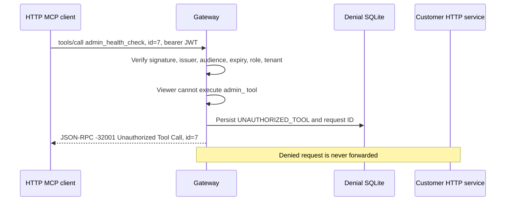

# BridgeLayer — Task 2: Follow an Authenticated HTTP Request

Task 2 adds a local HTTP MCP service and security gateway to the existing stdio prototype. No LLM is involved. Tasks 3–4 and the React console remain planned.

## Run the demonstration

```sh
npm ci
npm run check
npm run demo:http
```

The demo starts two loopback HTTP listeners with temporary customer/audit databases and random credentials. It initializes official SDK clients for viewer and admin roles, shows unfiltered discovery, looks up a fictional customer, creates a simulated refund, denies the viewer's admin call, allows the admin call, and rejects missing credentials. Cleanup closes clients/listeners and removes the temporary files. Tokens are not printed.

In VS Code, run the **HTTP Demo** task or select **Debug HTTP gateway demo**. Set breakpoints in the gateway authorization branch and customer handler to compare a denied call with an allowed one.

## Read the implementation in this order

1. [auth.ts](../src/gateway/auth.ts): JWT issuance and verification.
2. [server.ts](../src/gateway/server.ts): authentication, authorization, forwarding, errors, and correlation.
3. [http.ts](../src/mcp/http.ts): protected customer-service HTTP entry point.
4. [audit.ts](../src/gateway/audit.ts): durable denial records.
5. [common.ts](../src/http/common.ts): bounded request parsing and loopback HTTP lifecycle.
6. [demo-http.ts](../scripts/demo-http.ts) and [http.test.ts](../tests/http.test.ts): caller behavior and acceptance evidence.

## One viewer admin call



An admin request takes the other branch: the gateway forwards to the fixed service URL with a separate service credential. The original bearer token, cookies, and caller-supplied service headers are omitted. The service runs the same customer handlers/store and returns a result with the original ID.

Discovery is intentionally unfiltered. A viewer can see `admin_health_check` but cannot execute it. Seeing a tool definition does not grant permission.

## TypeScript through a Python lens

- `await jwtVerify(...)` is like awaiting a library verifier; decoding token text alone would not verify its signature.
- `z.enum(['viewer', 'admin'])` checks the actual claim at runtime. The `Identity` type is inferred from that schema.
- `AbortController` signals cancellation to `fetch` and response-body reads. It plays a role similar to cancellation/timeouts in a Python async workflow.
- `finally` releases timers/listeners and emits a diagnostic outcome whether the request succeeds or fails.
- An explicit header object works like constructing a fresh Python dictionary. It avoids copying credentials across trust boundaries.
- A fresh SDK transport per POST prevents unrelated callers using the same request ID from sharing transport state. Stateless refers to connection/session handling; customer and audit data still persist.

The SDK version's HTTP transport declarations need localized `as Transport` assertions under `exactOptionalPropertyTypes`. They bridge two compatible SDK types without weakening project-wide type checking. Omitting the session-ID generator selects stateless mode.

## Persistent local run

The launcher starts both listeners in one Node process. They have separate HTTP endpoints and credentials, not operating-system process isolation. All listeners bind `127.0.0.1`.

In a shell, build and create two different random secrets:

```sh
npm run build
export BRIDGELAYER_JWT_SECRET="$(node -e 'process.stdout.write(require("node:crypto").randomBytes(32).toString("hex"))')"
export BRIDGELAYER_SERVICE_KEY="$(node -e 'process.stdout.write(require("node:crypto").randomBytes(32).toString("hex"))')"
npm run start:http
```

To issue tokens in another terminal, that terminal must have the same JWT secret in its environment. Issuance is an explicit local operator action, not an HTTP login endpoint:

```sh
npm run --silent token -- viewer demo-tenant demo-user
npm run --silent token -- admin demo-tenant demo-admin
```

Treat the token output as a credential. The token command intentionally prints it; server/demo diagnostic logs do not. A caller possessing the JWT signing secret can mint admin tokens, so only the local operator should hold it.

| Environment variable | Default / behavior |
| --- | --- |
| `BRIDGELAYER_JWT_SECRET` | Required, at least 32 bytes; signs/verifies HS256 demo tokens. |
| `BRIDGELAYER_SERVICE_KEY` | Required, at least 32 bytes, different from JWT secret; downstream credential. |
| `BRIDGELAYER_GATEWAY_PORT` | `3030`; endpoint `http://127.0.0.1:3030/mcp`. |
| `BRIDGELAYER_SERVICE_PORT` | `3031`; protected downstream endpoint. |
| `SUPPORTBRIDGE_DB` | `data/supportbridge.sqlite`; existing customer/refund database. |
| `BRIDGELAYER_AUDIT_DB` | `data/gateway-audit.sqlite`; separate denial database. |

Stop with Ctrl+C or SIGTERM. No environment-file loader is installed; set variables in the shell/process environment. For the existing stdio server, continue using `node dist/src/mcp/stdio.js`; it exposes only the original two tools.

## Contracts and limits

- HTTP uses the pinned SDK's stateless Streamable HTTP mode with JSON responses. No sessions, standalone SSE stream, or server-initiated requests; GET/DELETE return 405 after authentication.
- POST requires JSON and an Accept header including `application/json, text/event-stream`. One message per POST; batches and caller session IDs are rejected. Request bodies are capped at 64 KiB with a three-second read timeout; downstream responses at 1 MiB.
- Host must match the current loopback listener; a present Origin must be that listener's localhost/127.0.0.1 HTTP origin. This is not browser cross-origin support.
- JWTs require HS256, JWT type, issuer `bridgelayer-demo`, audience `bridgelayer-gateway`, subject, issued-at, expiry, role, and tenant ID. Lifetime is at most 15 minutes; role is viewer/admin; identity identifiers use 1–64 letters, digits, underscores, or hyphens.
- Missing/invalid credentials produce HTTP 401 and a Bearer challenge before body parsing. No unverified identity or request-body data is used for that audit record.
- Denied admin requests produce HTTP 200 with JSON-RPC `-32001: Unauthorized Tool Call` and the same ID. Denied notifications get empty HTTP 202, no JSON-RPC reply, and no downstream execution.
- Downstream failure, invalid envelope, mismatched ID, redirect, or oversize response becomes sanitized HTTP 502 / `-32002`. Audit write failure also fails closed with a sanitized gateway failure.
- A three-second downstream timeout yields HTTP 504 / `-32003`, aborts local waiting, and warns that the operation outcome may be unknown. There are no automatic retries. Cancellation cannot undo a refund already committed by the service.
- Authorization/authentication denials persist in `gateway_denials`: event ID, timestamp, request ID when available, and a stable code. No token, subject, tenant, tool argument, customer record, or reason is stored there. No automatic retention deletion or audit query API exists; retain/remove the local demo database explicitly as an operator.
- Shared fictional customers have no tenant isolation. The role rule protects `admin_` tools only; viewers may still create simulated refunds. This is not authorization for real payments.
- Diagnostic logs add duration and outcome. The gateway correlates malformed tool-call envelope errors; the SDK can still reject a malformed stdio call before the application's tool logger.

## Validation evidence

The HTTP tests use real loopback listeners and official SDK clients, plus controlled downstream spies/failures. They cover discovery, token claims, service bypass, no credential passthrough, zero downstream denials, audit persistence/failure, hostile headers, malformed/batched/oversize input, concurrent duplicate IDs, invalid downstream replies, timeout, disconnection, shutdown, and log privacy. The existing stdio suite additionally verifies original refund/audit rows after a complete process restart.

The checks validate local behavior, not hosted operation, tenant isolation, rate-limiter concurrency, or an AI workflow.

## Explain it back

1. Why can a viewer discover an admin tool but not call it?
2. Why does the service credential differ from the client's JWT?
3. How can stateless HTTP still use persistent SQLite data?
4. Why must a timed-out refund never be automatically retried?
5. Why does a verified tenant claim not isolate customer records?

References: [MCP 2025-11-25 transport contract](https://modelcontextprotocol.io/specification/2025-11-25/basic/transports), [MCP authorization boundaries](https://modelcontextprotocol.io/specification/2025-06-18/basic/authorization), and [jose](https://github.com/panva/jose). The implementation preserves the repository's SDK pin; it does not claim migration to a newer protocol revision.
