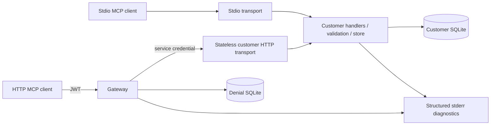

# BridgeLayer — Architecture

Status at the Task 2 implementation, verified locally September 15, 2026. Legend: **✅ Existing**, **🚧 In Progress**, **🗓 Planned**. Tasks 1–2 are implemented; no work is currently claimed as partially implemented. Later tasks remain planned.

## ✅ Existing request paths

| Component | Source | Responsibility |
| --- | --- | --- |
| Customer schemas/store | [schemas.ts](../src/customer/schemas.ts), [store.ts](../src/customer/store.ts) | Strict arguments, fictional lookup, integer cents, atomic refund/success-audit writes. |
| Customer server | [server.ts](../src/mcp/server.ts) | Tool discovery/dispatch and protocol/business errors. Two stdio tools; HTTP opts into a harmless third admin tool. |
| Stdio entry point | [stdio.ts](../src/mcp/stdio.ts) | Existing process transport, framing, shutdown. |
| HTTP entry point | [http.ts](../src/mcp/http.ts) | Service credential check; fresh SDK server/transport for each POST; JSON responses. |
| Gateway | [server.ts](../src/gateway/server.ts) | Authenticate, authorize, forward with explicit headers, validate replies, bound/cancel failures, correlate logs. |
| JWTs | [auth.ts](../src/gateway/auth.ts) | jose HS256 verification/issuance with constrained claims and 15-minute lifetime. |
| Denial persistence | [audit.ts](../src/gateway/audit.ts) | Separate SQLite database with minimal authentication/authorization denial records. |
| HTTP boundary | [common.ts](../src/http/common.ts) | Loopback listeners; Host/Origin, method/header, body-size, timeout, and envelope checks. |
| Local launcher | [main.ts](../src/http/main.ts) | Starts gateway and protected service in one Node process; configured secrets/ports/storage; signal shutdown. |
| Clients/tests | [demo-http.ts](../scripts/demo-http.ts), [http.test.ts](../tests/http.test.ts) | Official SDK clients, real HTTP tests, downstream spies and failure injection. |

The SDK owns MCP initialization, dispatch, framing/serialization, and response IDs. The pinned SDK is used without a protocol upgrade. The transports are stateless: no session identifier, SSE GET stream, or server-initiated interaction is supported. GET/DELETE return 405. Simultaneous clients may reuse request IDs because each POST has an independent transport.

## ✅ Existing HTTP trust boundaries

The local launcher binds both endpoints to 127.0.0.1. It is one process with separate HTTP credentials/endpoints, not process isolation. Customer SQLite is shared fictional data; tenant claims do not isolate rows.

1. Validate the destination Host and any Origin; no cross-origin browser UI is exposed.
2. Verify the caller's JWT before reading its body. Require signature, HS256/JWT type, issuer, audience, subject, issued-at, expiry, viewer/admin role, and a valid tenant identifier.
3. Validate a single JSON-RPC message. Batches, fake session headers, unsupported versions, and oversized input fail before forwarding.
4. Deny viewer calls whose tool name starts `admin_`; persist the denial and return exactly `-32001: Unauthorized Tool Call` with the same ID. A denied notification gets empty HTTP 202.
5. Otherwise send the message to a fixed loopback service URL using a separate service credential. Do not forward bearer tokens, cookies, caller service keys, or redirects.
6. The service requires that credential and invokes the existing business logic. A bearer token alone cannot bypass the gateway.
7. Validate the downstream JSON-RPC envelope and matching ID; relay valid results, including unfiltered discovery.

JWT issuance is a local operator CLI, not a login/OAuth server. Anyone with the signing secret can issue admin tokens. Service and JWT secrets must differ. The admin policy protects only the prefix; viewers may execute simulated refunds. No real payment service exists.

## ✅ Existing persistence and error handling

Customer SQLite retains its original schema: customers, refunds, and successful-refund audit events. Refund/audit inserts commit together; an injected audit failure rolls them back. The full-restart test now proves original refund data and its linked audit survive stopping/restarting the server.

Gateway denials use a separate database/table, avoiding migration of the existing customer schema. Records contain an event ID, timestamp, request ID if available, and INVALID_CREDENTIALS/UNAUTHORIZED_TOOL. Tokens, subjects, tenants, tool arguments, records, and reasons are omitted. Audit failure blocks forwarding and returns a sanitized gateway error. No automatic audit deletion/retention policy or query API is implemented.

Invalid tool arguments still yield `-32602`; business failures use `isError: true`; unexpected customer exceptions yield sanitized `-32603`. Gateway authentication failures use HTTP 401. Downstream invalid/unavailable replies or audit failure use HTTP 502 / `-32002`; timeout uses HTTP 504 / `-32003`.

Default bounds: 64 KiB input; three-second body read; 1 MiB downstream response; three-second downstream timeout. Client disconnection or gateway shutdown aborts outstanding downstream fetches. There are no retries. An abort or timeout cannot reverse a refund already committed; its result may be unknown to the caller.

## ✅ Existing diagnostics and remaining limits

Tool and gateway diagnostics include duration and outcome. Gateway logs preserve correlation for malformed tool-call envelopes rejected by the SDK before the customer handler; a malformed stdio call may still bypass the application tool logger. Stdout remains protocol-only for the stdio server. The token-issuance CLI explicitly writes a requested token to its stdout.

SQLite calls are synchronous; long statements/busy waits can block the event loop. General multi-process lock-contention capacity, throughput, versioned customer-schema migrations, and tenant isolation are not implemented or measured. Database output still relies on the controlled schema and a TypeScript row assertion. No centralized tracing/metrics service or remote deployment is present.

## 🗓 Planned later components

| Component | Intended role |
| --- | --- |
| Task 3: LLM streaming guardrail | Byte/event/text boundaries, bounded ambiguity buffers, deterministic redaction tests and measurements. |
| Task 4: token limiter/model fallback | Tenant usage reservations/reconciliation, concurrent admissions, provider attempt/fallback policy. Existing SQLite is infrastructure only; no budget tables exist. |
| Provider adapters | Start with deterministic mocks; live provider/model undecided. |
| React console/application backend | Exercise implemented backend behavior. No UI exists today. |
| Autonomous agent / external customer APIs / hosting | Separate extension candidates; no selected vendor or implementation. |

Detailed future behavior is in [PROJECT_PLAN.md](PROJECT_PLAN.md). Current configuration and a request-by-request explanation are in the [HTTP walkthrough](02-http-gateway-walkthrough.md).

## Validation and chronology

Task 1 and the earlier learning documents predate September 11. Documentation reconciliation and Task 2 belong to the active phase beginning September 11. On September 15, type checking, 23 tests/subtests, and the HTTP demo passed locally on Node 25.5.0. Recommended Node 24, a fresh dependency installation, remote CI, and hosted performance have not been verified by those checks.

Git metadata, absent during the earlier inspection, is now present; no history was rewritten. Runtime identifiers retain their existing SupportBridge names as documented in [README](../README.md).
