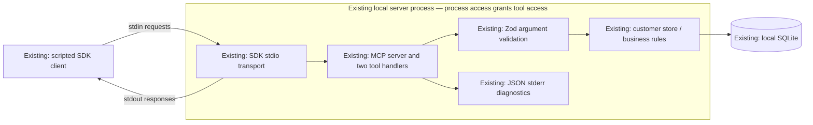
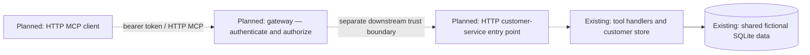

# BridgeLayer — Architecture

This document describes the inspected implementation and separately labels its extensions. The project was previously named SupportBridge; existing package, server, database configuration, and workspace identifiers retain that name. See [README](../README.md) for runnable commands, [PROJECT_SCOPE.md](PROJECT_SCOPE.md) for the active phase, and [PROJECT_PLAN.md](PROJECT_PLAN.md) for the long-term roadmap.

Legend: **✅ Existing**, **🚧 In Progress**, **🗓 Planned**. “Partial” describes limits within an existing capability, not active development. No application component is currently in progress.

## ✅ Existing: local MCP service

| Component | Source | Responsibility |
| --- | --- | --- |
| Scripted MCP client | [demo.ts](../scripts/demo.ts) | Spawn the server, initialize, discover tools, and explicitly call lookup/refund paths; no LLM. |
| Process entry point | [stdio.ts](../src/mcp/stdio.ts) | Construct store/server/transport, map framing errors, handle stdin end and shutdown signals. |
| MCP server/tools | [server.ts](../src/mcp/server.ts) | Advertise `get_customer_record` and `trigger_refund`; validate, dispatch, and map results/errors. |
| Argument schemas | [schemas.ts](../src/customer/schemas.ts) | Strict runtime input constraints and inferred TypeScript types. |
| Customer store | [store.ts](../src/customer/store.ts) | Fictional customer lookup, whole-cent checks, SQLite schema/seeding, refund/audit transaction. |
| Diagnostics | [logger.ts](../src/logger.ts) | Explicit JSON fields written to stderr. |
| Integration tests | [mcp.test.ts](../tests/mcp.test.ts) | Real stdio process checks and direct non-JSON numeric validation. |

The server identifies itself as `supportbridge-customer`, version 0.1.0. Only MCP tools are advertised; resources and prompts are not registered. There is no HTTP listener, browser API, external customer API, payment integration, or model provider.

## ✅ Existing: one request and its boundaries

1. The demo spawns a separate Node process. The SDK initializes MCP and carries newline-delimited messages through stdin/stdout.
2. The handler selects the named tool and validates untrusted arguments with Zod.
3. Validated input reaches the store. Lookup checks customer existence; refunds also enforce supported whole cents.
4. Refund and success-audit inserts commit in one SQLite transaction. An audit insert failure rolls back the refund.
5. The handler returns structured content plus JSON text, or maps an error. The SDK correlates the response with the request ID.

Invalid arguments produce `-32602`; business failures return a tool result marked `isError: true`; unexpected service failures produce sanitized `-32603`. Unknown methods and framing behavior are documented in the [decision log](decisions.md). The pinned SDK's uncorrelatable framing-error envelope omits an ID.

The current trust boundary is access to the local process and its database. Argument validation does not authenticate a caller or authorize an action. The database has no tenant column or tenant-filtered queries. Repeated valid refunds create separate receipts; request IDs provide correlation, not idempotency.

## ✅ Existing: persistence, diagnostics, and limits

SQLite persists `customers`, `refunds`, and successful-refund `audit_events`. It uses foreign keys, WAL, a three-second busy timeout, and synchronous calls. No throughput or multi-host capacity is established. Startup creates tables if absent; no versioned schema migration mechanism exists.

The store casts customer rows to a TypeScript interface rather than validating database output at runtime. This relies on the controlled local schema. Imported data would need an agreed validation boundary.

Observability is **partial**: handled tool outcomes have timestamps, request IDs, tool names, and outcomes, but malformed call envelopes are parsed before the handler's logging `try` block. They therefore bypass correlated tool-outcome logging. No duration metric is recorded. Diagnostic call sites exclude customer records/refund reasons; reasons remain in the fictional database. Durable denied-attempt auditing does not exist.

The six tests cover real stdio behavior and transactional rollback. Current persistence checks inspect refund/audit rows while the original process runs and start another process for a seeded customer lookup. They do not yet prove the original refund/audit records survive a complete process stop/restart. Dedicated lock-contention and signal/error shutdown tests are also absent.

## 🚧 In Progress

No application implementation is in progress at this documentation baseline. Documentation reconciliation is complete; gateway and reliability work remain planned until code changes begin.

## 🗓 Planned: next HTTP/security boundary

Dashed edges represent unimplemented connections. The proposed gateway will verify signed demo-token claims and enforce execution policy while forwarding authenticated discovery unfiltered. A harmless mock `admin_` tool is planned, not present.

Non-admin `admin_` calls must return `-32001: Unauthorized Tool Call` with the request ID intact and never execute downstream. The inbound bearer token must not be forwarded. HTTP/session handling, downstream credentials/protection against bypass, authentication-error mapping, cancellation, and denial-audit storage need design agreement.

The initial scoped dataset remains shared and fictional. Verified tenant identity will not imply customer-data isolation. The prefix policy does not establish real-refund authority. Preserve stdio and do not automatically replay refund calls on network failure.

## 🗓 Planned: later AI and console components

| Component | Status | Intended boundary |
| --- | --- | --- |
| Application backend / React console | 🗓 Planned | Exercise actual gateway behavior; no UI exists today. |
| LLM gateway / provider adapters | 🗓 Planned | Begin with deterministic mocks; live provider/model undecided. |
| Streaming PII guardrail | 🗓 Planned | Decode bytes, parse provider events, inspect incremental text before forwarding safe output. |
| Token reservation / model router | 🗓 Planned | Authenticate tenant identity, reserve/reconcile usage, control fallback before output is committed. |
| Budget persistence | 🗓 Planned | Reuse SQLite infrastructure with new schema/transactions; no budget tables exist. |

A live autonomous agent and external customer APIs are separate extension candidates, with no implementation or selected vendor. A future agent would choose tools; today's client explicitly calls them. Detailed streaming, budget, and fallback requirements remain in [PROJECT_PLAN.md](PROJECT_PLAN.md).

## Evidence

The architecture reflects the prior source inspection and the baseline locally validated on September 11, 2026: type checking, six tests, and the scripted demo passed on Node 25.5.0. The documentation update changes no application behavior. Remote CI, deployment, concurrency capacity, and AI evaluations remain unverified.
