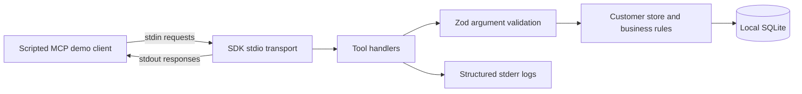

# SupportBridge — Project Scope

| Field | Value |
| --- | --- |
| Project name | SupportBridge |
| Project type | Independent Software / AI Development |
| Developer | Yu-Chen Su (preferred name: Will) |
| Role | Independent Software & AI Consultant |
| Current development phase start date | September 11, 2026 |
| Scenario | Customer-inspired scenario / integration case study using fictional customer data and simulated refunds |
| Document baseline | Repository inspection and local validation on September 11, 2026 |

## Project history and evidence

SupportBridge existed before September 11, 2026 as a personal/FDE side project. September 11 marks the beginning of a new active professional development phase, continuing that existing work. It is not the project's original creation date. No evidence of an actual client engagement was found in the inspected files; this document makes no claim of paying clients, deployed customer usage, or commercial outcomes.

The earlier baseline comprises Task 1: the customer MCP server, SQLite storage, validation and error handling, stdio integration tests, demo client, and learning documentation. These were present and locally exercised in the September 8, 2026 review in the accompanying development conversation. The existing [README](../README.md), [handoff](../HANDOFF.md), [walkthrough](01-mcp-walkthrough.md), and [decision log](decisions.md) also describe that baseline as implemented. Tasks 2–4 and the React console were already documented as planned.

The inspected workspace has no `.git` metadata; `git status` and `git log` report that it is not a Git repository. Commit dates, historical diffs, remote branches, and remote issues could not be verified. The pre-phase attribution above relies on the developer's statement and the earlier inspection, not a commit-history audit or file timestamps. No Git repository was initialized and no historical commits were changed. If the original Git checkout is supplied later, preserve its history and record new development prospectively.

## Problem statement

This integration case study explores how to expose customer-support data and operations through a discoverable, validated MCP interface. Its implemented foundation demonstrates customer lookup and simulated refund creation with predictable error behavior and atomic database writes. The existing roadmap extends that foundation toward authenticated HTTP access and reliable AI-provider integration.

The engineering problem is to keep protocol handling, input validation, business rules, persistence, and future gateway policies understandable and testable at their boundaries. This is a reference scenario, not a claim that a real support organization commissioned or adopted the system.

## Target users and use case

The intended scenario is a support operator looking up a customer and requesting a simulated refund. The current runnable interface is a developer-operated MCP client, not an operator-facing application. Developers and technical reviewers can use the demo and tests to inspect the integration behavior; no actual external user population has been established.

Current demonstration: initialize an MCP connection, discover tools, retrieve a fictional customer, create a simulated USD refund, and observe invalid-argument rejection. The React support console described in the roadmap remains planned.

## Current system capabilities

| Capability | Implemented behavior and evidence |
| --- | --- |
| MCP server | One server, `supportbridge-customer` version `0.1.0`, using the official SDK's lower-level `Server` API over stdio; [server.ts](../src/mcp/server.ts), [stdio.ts](../src/mcp/stdio.ts). |
| Tool discovery | `tools/list` returns two tool definitions with generated JSON input schemas and annotations. |
| Customer lookup | `get_customer_record(customer_id)` returns a seeded fictional record or `CUSTOMER_NOT_FOUND`. |
| Simulated refunds | `trigger_refund(customer_id, amount, reason)` stores a receipt and successful-refund audit event in one transaction. Receipts report integer `amount_cents`, USD currency, and simulated status. No payment API is called. |
| Runtime validation | Zod rejects extra properties, malformed IDs, nonpositive/nonfinite amounts, numeric strings, and reasons shorter than ten characters after trimming; [schemas.ts](../src/customer/schemas.ts). |
| Business validation | The store checks customer existence and safely representable whole cents. Repeated valid calls create separate receipts; there is no idempotency key. |
| Local data integration | Built-in SQLite stores `customers`, `refunds`, and `audit_events`; three fictional customers are seeded. Foreign keys, WAL, a busy timeout, and refund/audit transactions are configured; [store.ts](../src/customer/store.ts). |
| Errors and logging | Argument failures map to JSON-RPC `-32602`; business failures return `isError: true`; unexpected service errors are sanitized. Explicit diagnostic fields are written as JSON to stderr; [logger.ts](../src/logger.ts). |
| Development workflow | Type checking, six automated tests, a real SDK-client demo, VS Code tasks/debug configuration, and a GitHub Actions Node 22/24 workflow definition. Remote CI execution is unverified. |

Only tools are advertised as MCP capabilities. No MCP resources or prompt handlers are registered. There are no implemented third-party CRM, ticketing, payment, or hosted API integrations.

## AI / LLM / agent workflow status

There is no implemented LLM invocation, provider adapter, autonomous agent loop, model selection, or AI-output evaluation. [scripts/demo.ts](../scripts/demo.ts) explicitly selects and calls tools in a fixed sequence; MCP does not itself make those calls agent-driven.

The existing roadmap proposes an LLM gateway, streaming PII guardrail, token budget, and provider fallback with deterministic mocks. A live agent that decides which tools to invoke is documented as a separate possible extension after the gateways work. No provider, model, agent framework, or external API vendor is selected by this scope document.

## Current development objectives

1. Establish an accurate professional-phase baseline while preserving the project's earlier history.
2. Continue the existing roadmap, starting with discussion and design of Task 2's HTTP MCP security gateway while retaining stdio behavior.
3. Make allowed and denied integration paths reproducible through tests and demonstrations.
4. Address evidenced reliability and logging gaps as the system gains network boundaries.
5. Maintain documentation that separates working capabilities, planned milestones, and proposals awaiting agreement.

The prioritized [development plan and README review](DEVELOPMENT_PLAN.md) proposes work for September 11–24, 2026. It is a planning proposal, not a completion record or authorization for major architectural changes.

## Scope

The current foundation includes the customer MCP service, fictional SQLite data, simulated refunds, error handling, diagnostic logs, tests, demo, and technical documentation.

The existing planned scope includes Task 2 (HTTP MCP security gateway), Task 3 (streaming PII guardrail), Task 4 (SQLite token limiter and model fallback), and the React support console. Their detailed requirements remain in [architecture.md](architecture.md); they are not implemented by this documentation update.

Real payments, production customer data, a complete OAuth authorization server, multi-host scalability, live autonomous agent execution, and a hosted production deployment are outside the implemented scope. Additional external API integrations, agent workflows, deployment targets, and material architectural changes require discussion and agreement before implementation. No new vendor, customer, or technology is committed here.

## Deliverables

| Status | Deliverable |
| --- | --- |
| Existing before the new phase | Runnable stdio MCP customer service and SQLite store. |
| Existing before the new phase | Six automated tests, SDK-client demo, setup instructions, architecture/decision documentation, and VS Code learning/debug workflow. |
| Established September 11, 2026 | This scope baseline and a proposed development backlog with README recommendations. |
| Planned, following design agreement | HTTP MCP gateway implementation, integration tests, allowed/denied demonstration, and documented trust boundaries. |
| Later roadmap | Streaming guardrail, token reservation/fallback behavior, deterministic validation evidence, and React console. |

## Tech stack

Versions below are repository pins, not claims about the latest available releases.

| Layer | Existing technology |
| --- | --- |
| Language/build | TypeScript `7.0.2`, strict compiler settings, ES modules, ES2022 target, generated JavaScript in `dist/`. |
| Runtime | Node.js; `.nvmrc` selects 24 and `package.json` declares `>=22.13.0`. Local September 11 validation used Node `25.5.0`. |
| Package management | npm with `package-lock.json`; local npm `11.8.0`. |
| MCP | `@modelcontextprotocol/sdk` `1.30.0`, client/server stdio transports. |
| Validation | Zod `4.5.4`, including JSON Schema generation. |
| Persistence | Built-in `node:sqlite` synchronous API; no separate database server. |
| Tests/automation | Node test runner and assertions; GitHub Actions workflow definition for Node 22 and 24. |
| Development tools | VS Code tasks, child-process debugger attachment, source maps. |

React is a planned technology, not an installed application in this baseline. No HTTP framework or LLM SDK is used by the application source.

## Architecture summary

The entry point constructs the store, server, and transport. The SDK handles initialization, dispatch, message serialization, and response correlation. Handlers select a tool, validate arguments, call the store, and map results or exceptions. The store owns SQL and refund/audit atomicity. Server stdout is reserved for protocol messages; diagnostics use stderr.

The proposed next boundary is an authenticated HTTP MCP gateway in front of an HTTP entry point for the customer service. Reusing the handlers/store is consistent with the existing design, but HTTP session handling, downstream trust, tenant semantics, and failure policies must be settled before implementation. The full future architecture diagram is explicitly labeled planned in [architecture.md](architecture.md).

## Testing / validation plan

Baseline validation was rerun on September 11, 2026 using the existing installed dependencies:

- `npm run check`: strict type checking and all six tests passed. Five tests launch the actual stdio process; one directly checks non-JSON numeric values at the schema boundary.
- `npm run demo`: tool discovery, fictional customer lookup, a simulated `1250`-cent refund, and invalid-amount rejection succeeded. The demo used and removed a temporary database.
- Node emitted its SQLite experimental warning on stderr. It did not break the protocol checks.

Existing coverage includes invalid arguments with no writes, exact cents, business errors, injected audit failure with rollback, sanitized internal errors, malformed frames, request-ID correlation, notification behavior, and stdout isolation. This validation did not perform a fresh `npm ci`, run the Node 22/24 CI matrix, or establish production reliability or throughput.

For subsequent work, preserve these checks and add behavior-focused integration tests for each new boundary. Priorities are refund/audit persistence after a complete process restart; HTTP initialization/discovery/calls; invalid and expired demo tokens; role denials with zero downstream execution; sanitized downstream failures; and log field/privacy assertions. Later guardrail and limiter evaluations should use the deterministic split-boundary, cancellation, concurrency, timing, and fallback cases already specified in the architecture roadmap. Report measurements only after running them.

## Future milestones

| Milestone | Current status and intended outcome |
| --- | --- |
| Task 1: customer MCP service | Implemented before this phase; maintain and strengthen relevant regression evidence. |
| Task 2: HTTP MCP security gateway | Planned next. Verify signed demo-token claims; forward authenticated discovery without filtering; reject non-admin `admin_` calls with `-32001: Unauthorized Tool Call`, preserving the request ID; never forward the inbound bearer token downstream. |
| Task 3: streaming PII guardrail | Planned. Incremental decoding/parsing/inspection, bounded ambiguity buffers, documented pattern limits, and deterministic streaming tests. |
| Task 4: token limiter and fallback | Planned. Per-tenant rolling budgets, atomic reservations and reconciliation, and explicitly bounded fallback behavior; timeout details remain design proposals. |
| React support console | Planned after backend behavior can be demonstrated; exercise actual backend paths with fictional data. |
| Agent / external API / deployment extensions | Discussion candidates. Define a bounded use case and validation criteria before selecting providers or implementation technologies. |

Development continues through explain → agree → implement → demonstrate → practice explaining back, with code inspection and discussion in VS Code.
