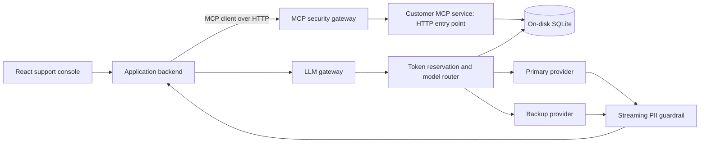

# Architecture and remaining milestones

The agreed portfolio is a customer support integration platform in TypeScript. The user is comfortable with Python, is learning TypeScript, and is targeting customer-facing FDE / full-stack integration roles. Teaching, reproducible failures, and interview explanations are deliverables alongside implementation.

## Current implementation

Demo MCP client → official stdio transport → tool handlers → Zod validation → customer store → on-disk SQLite.

The same store can be reused by another transport. It currently stores fictional customer records, simulated refunds, and successful-refund audit events. Structured stderr logs record tool outcomes without customer details or reasons.

## Planned end state

Each gateway will also be directly testable without the UI. Provider adapters will support deterministic mocks; live integration is an optional later step. Browser requests must exercise backend behavior, rather than using UI-only switches that pretend authorization or fallback happened.

## Task 2: MCP security gateway

Add HTTP transport to the customer service without breaking its stdio entry point. A harmless mock admin tool supports testing. Verify demo token signatures, issuer, audience, expiry, role, and tenant identity. Local signed demo tokens are not a complete OAuth authorization-server implementation.

For authenticated traffic, forward `tools/list` without filtering. Block non-admin calls to `admin_` tools with exactly `-32001: Unauthorized Tool Call` and preserve the request ID. Do not forward the inbound bearer token to the downstream service. Prove denied requests never reach the downstream mock. The prefix rule is the assessment minimum; define a separate policy before giving refund execution real business authority.

## Task 3: streaming guardrail

Separate byte decoding, provider-event parsing, and incremental text inspection. Test every split position for supported sensitive patterns, plus multiple events per network chunk, escaped text, Unicode boundaries, final flush, client cancellation, and slow consumers. Keep ambiguity buffers bounded. Oversized ambiguous sequences should be suppressed conservatively until a safe boundary. Document supported formats and false-positive / false-negative limits.

Measure time to first safe output, added redaction latency, and peak buffer size with deterministic test input. No performance result has been measured yet.

## Task 4: SQLite token limiter and fallback

Implement a per-tenant rolling 60-second budget, initially 50,000 tokens. Authenticate tenant identity rather than accepting an arbitrary tenant field. Reserve estimated input plus output allowance atomically before dispatch; reconcile actual usage and track provider attempts. Define expiry for usage records separately from live reservations so a long-running stream cannot lose its reservation merely because a minute passed. Unknown provider usage needs a conservative documented policy.

The proposed streaming timeout is 3,000 ms until first usable upstream text. A primary 429 or qualifying timeout triggers cancellation and one backup attempt before output reaches the client. Establish a separate policy for stalls after the first delta. Never silently combine a partially emitted primary answer with a new backup answer. Return sanitized gateway errors, including a defined error event when streaming has already begun.

Test parallel budget admissions, exact window boundaries, reservation cleanup, timeouts racing with success, late primary responses, backup failure, restart behavior, and sanitized errors. Short SQLite transactions and explicit busy handling are required. Do not claim the local SQLite solution scales across multiple hosts.

## Demo and delivery

The React console will show customer lookup, simulated refunds, viewer/admin behavior, synthetic PII redaction, provider failure injection, tenant budgets, and request traces. A live LLM agent that autonomously orchestrates tools is not implemented by these assessment tasks; evaluate that as a separate extension after the gateways work.

For each milestone: explain the concepts, settle material design changes, implement focused behavior, demonstrate successes and failures, and practice an interview explanation. Next: discuss the existing server in VS Code, then implement Task 2.
